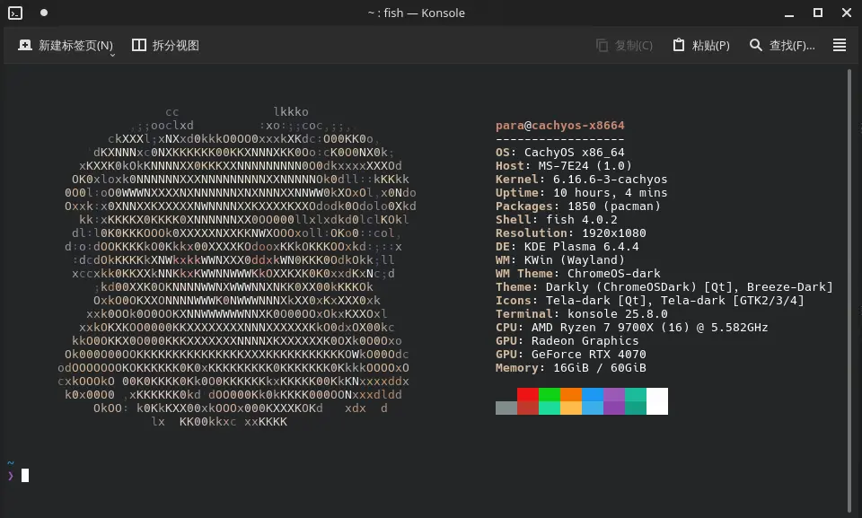

# 安装jp2a
```bash
paru jp2a
```


# 转换图片到ascii形式的文本
:::Tip
最好是已经抠图过的png图片
:::
```bash
jp2a logo.jpg --size=20x10 --color --background=light >logo.txt
```
记得将logo.txt移动到 __~/.config/fastfetch/__ 下
# logo设置
```jsonc title="~/.config/fastfetch/config.jsonc"
"logo": {
        "source": "~/.config/fastfetch/logo.txt",
        "type": "file",
        "height": 1,
        "width": 1,
        "padding": {
            "top": 0,
            "left": 0
        }
```

# 颜色设置
全局颜色设置
```jsonc title="~/.config/fastfetch/config.jsonc" "title" "keys" 
"display": {
    "color":{
        "keys":"#d4b99e",
        "title":"#ce846f"
    },
```

# 效果展示


<details>
<summary>备份参考</summary>

```jsonc title="~/.config/fastfetch/config.jsonc"
{
    "$schema": "https://github.com/fastfetch-cli/fastfetch/raw/dev/doc/json_schema.json",
    "logo": {
        "source": "~/.config/fastfetch/logo.txt",
        "type": "file",
        "height": 10,
        "width": 7,
        "padding": {
            "top": 3,
            "left": 7
        }
    },

    "display": {
        "color":{
            "keys":"#d4b99e",
            "title":"#ce846f"
        },
        "size": {
            "ndigits": 0,
            "spaceBeforeUnit": "never"
        },
        "freq": {
            "ndigits": 3,
            "spaceBeforeUnit": "never"
        }
    },
    "modules": [
        "break",
        "break",
        "break",
        "break",

        "title",
        "separator",
        "os",
        "host",
        {
            "type": "kernel",
            "format": "{release}",
        },
        "uptime",
        {
            "type": "packages",
            "combined": true
        },
        "shell",
        {
            "type": "display",
            "compactType": "original",
            "key": "Resolution"
        },
        "de",
        "wm",
        "wmtheme",
        "theme",
        "icons",
        "terminal",
        {
            "type": "terminalfont",
            "format": "{/name}{-}{/}{name}{?size} {size}{?}"
        },
        "cpu",
        {
            "type": "gpu",
            "key": "GPU",
            "format": "{name}"
        },
        {
            "type": "memory",
            "format": "{used} / {total}"
        },
        "break",
        "colors"
    ]
}
```

</details>