>按照最新的顺序排序

# 2025

       
点击展开

       

## `花音(幻树の破晓)`
07-02

## `柴崎步`
05-07

<u>衣服部分</u>

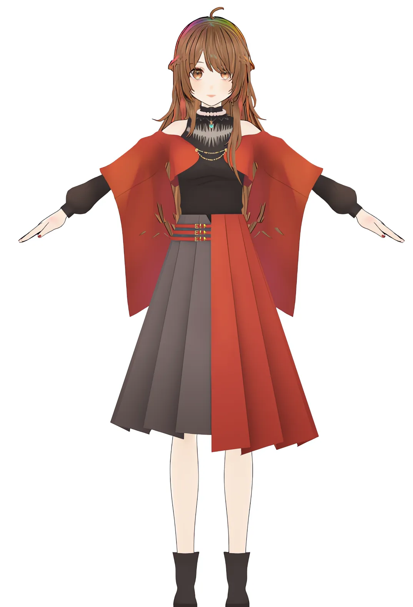

## `耶斯yeki.256ver`
05-04

---

# 2024

       
点击展开

       

>## `芙姆米Fumi`
- 09-07
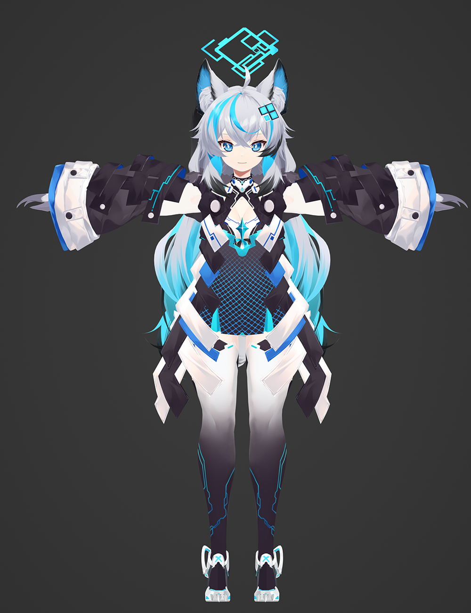

## `阿卡伊Akai`
09-11
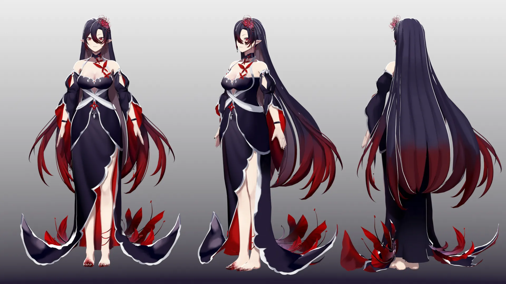

## `叛逆期艾伊`
06-20
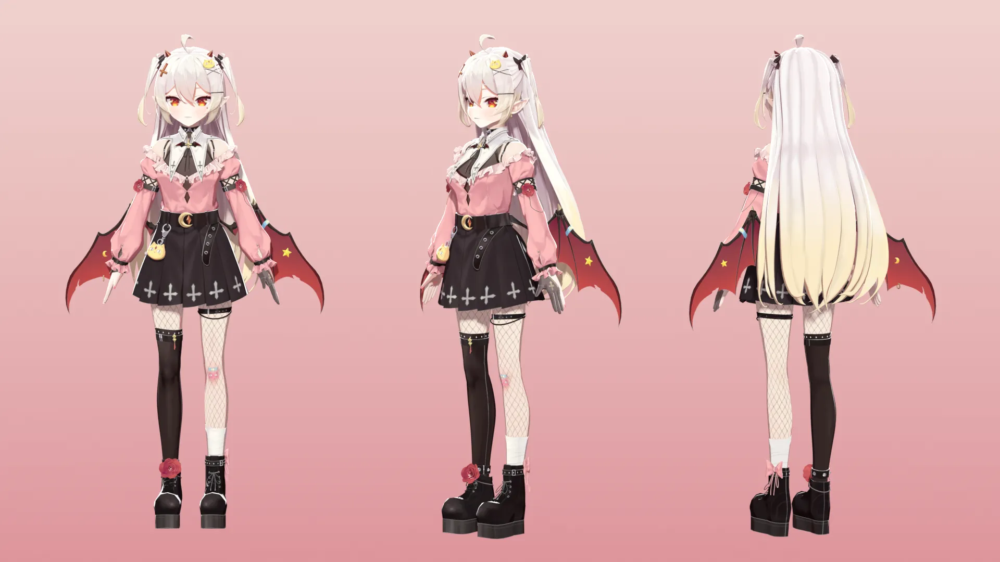

## `珂蒂Cordelia`
06-06

## `萝米摸鱼中`
01-22
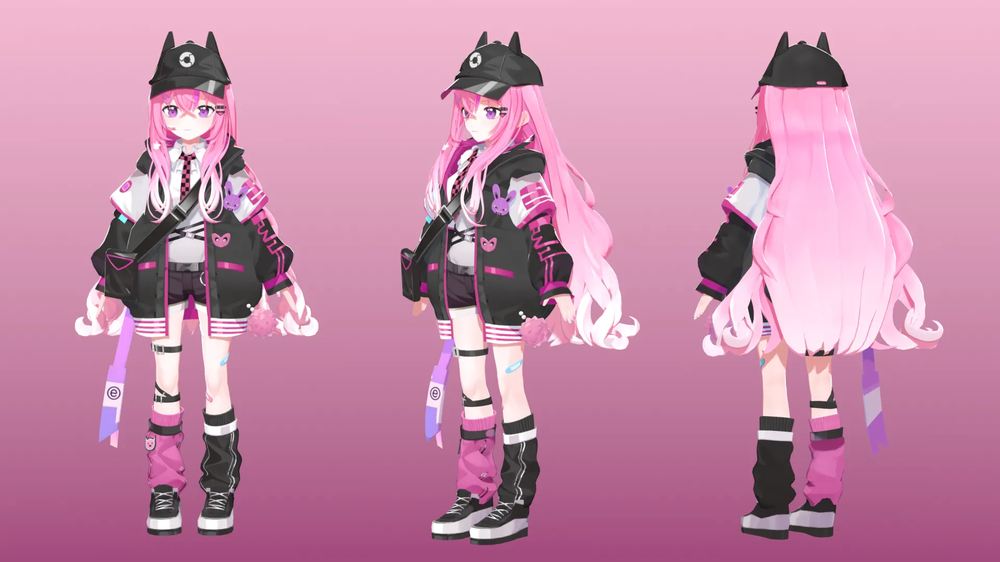

---
# 2023

       
点击展开

       

## `向晚古风`
12-26

## `归归`
12-07
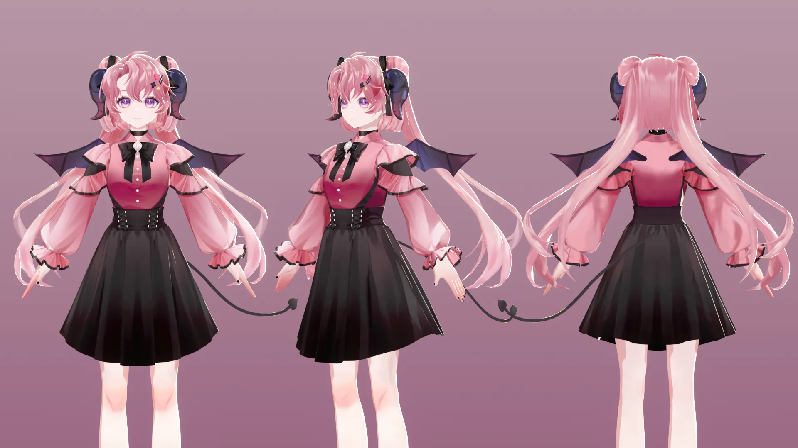

## `零梦RinMon`
08-10

<u>衣服部分</u>

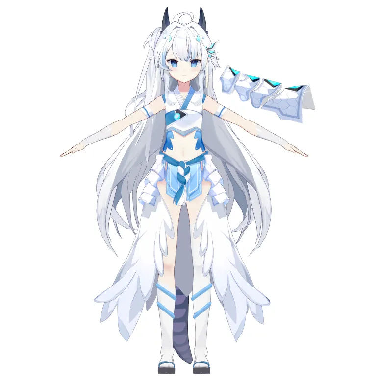

## `東雪蓮新私服5.5`
07-16

## `贝拉古风`
06-03

## `多萝丝赛露`
05-01
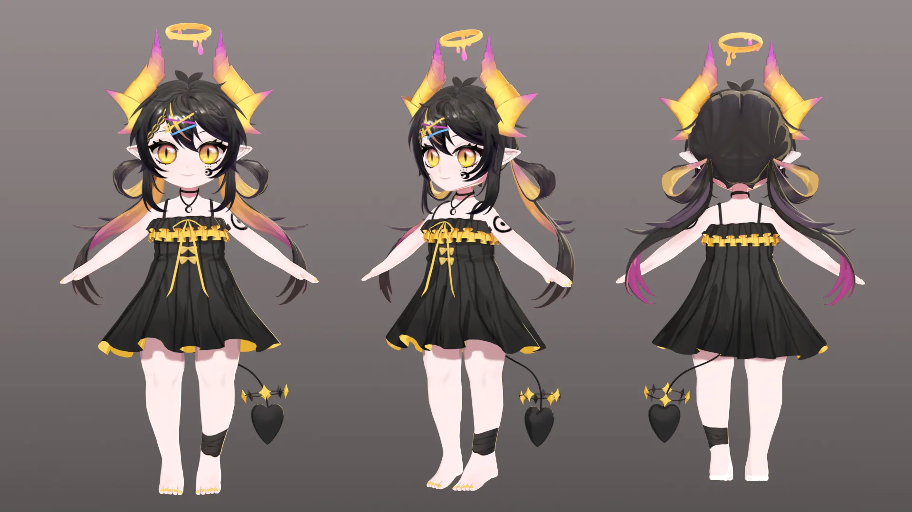

## `薛定谔的咕`
03-24
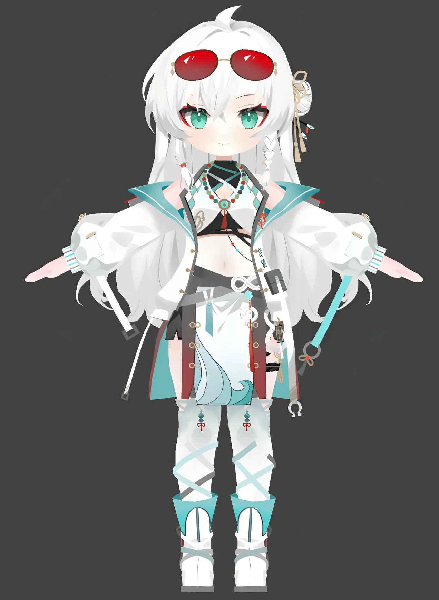

## `珈乐毛衣`
02-27

## `OREO`
02-09

---
# 2023以前

       
黑历史

       

## `慕宇`
2022-12

## `珈乐`
06-27

## `阿草`
2021-09

## `Ruki`
2021-06

## `Nana7mi`
2021-02
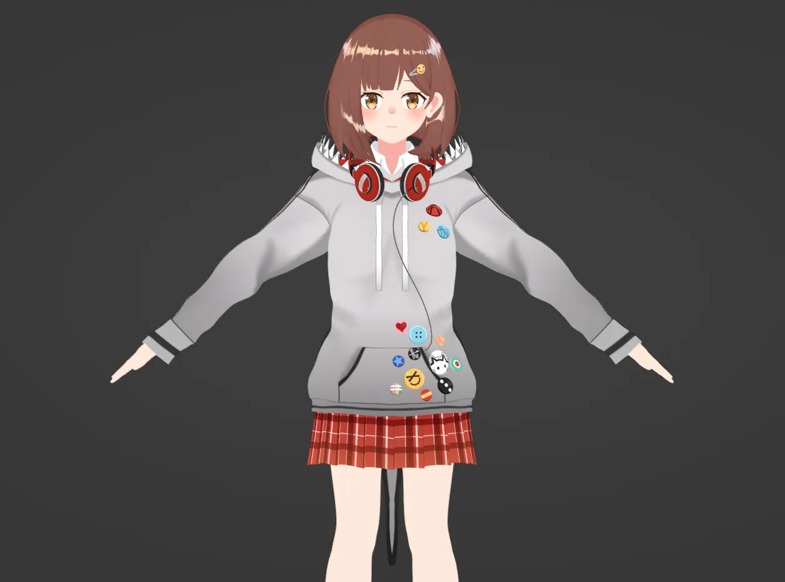

## `Hanon`
2021-01
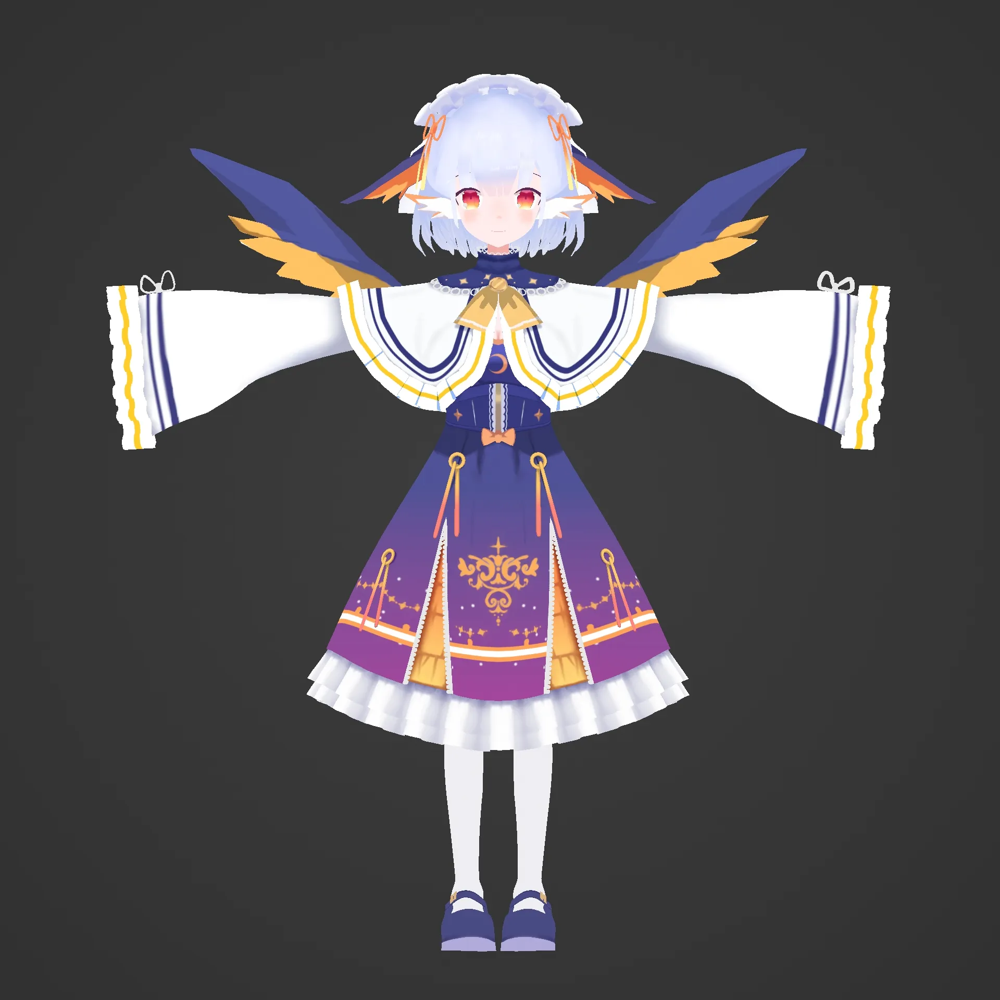

## `Aer`
2020-05

---       

