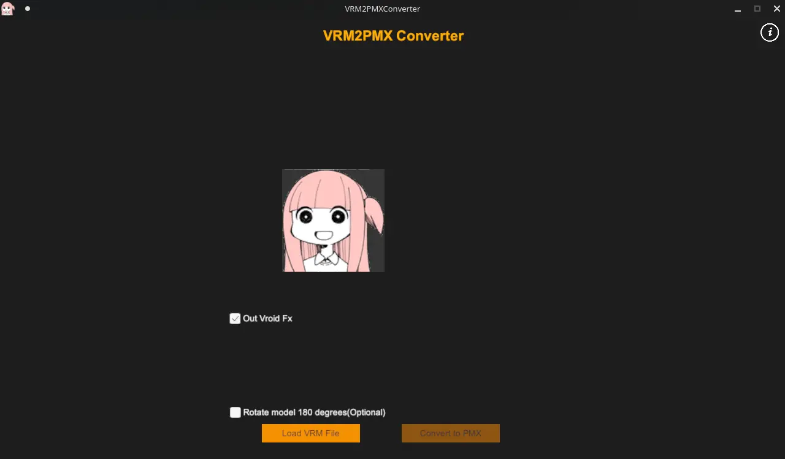

# 前言
- 所需软件:
    - [blender](https://www.blender.org/)
    - [vrm插件](https://github.com/saturday06/VRM-Addon-for-Blender)(4.5版本可直接在扩展中安装)
    - [cats插件](https://github.com/absolute-quantum/cats-blender-plugin)
    - [VRM2PMXConverter](https://github.com/superowner/VRM-to-Pmx-Converter)
        - 这里推荐使用[此版本]()
        - 因为原版本导出模型会将uv宽度x3，导致后面会多一步模型修改
    

大致思路
- 导入**blender**，经过vrm插件绑定为vrm
- 然后使用**VRM2PMXConverter**转换为pmx
- **PmxEditor**内修改骨骼及其物理

# 绑定为vrm
参考此篇
[任意模型转vrm](../vrm-create/vrm-create/)

# VRM2PMXConverter
拖进去，转换即可

# blender内修改
对导出的pmx模型进行修改

# PmxEditor
更多的是使用经验来
## 补充所需骨骼

## 设置骨骼物理

## 显示杂设置

## 表情设置

导出为pmx
---

**最后在MMD中检查**

done