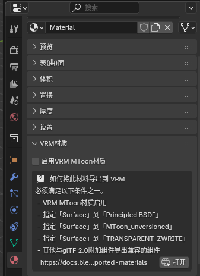
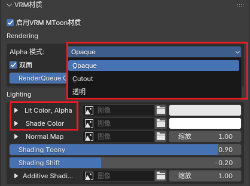

# 前言
- 所需软件:
    - [blender](https://www.blender.org/)
    - [vrm插件](https://github.com/saturday06/VRM-Addon-for-Blender)(4.5版本可直接在扩展中安装)
    - 物理部分-Unity[2021.3.18f1]
        - [Univrm](https://github.com/vrm-c/UniVRM)
        - **可选** [VrmSpringBoneTool&VrmSkritTool](https://nalulululuna.booth.pm/items/4649509)
    

大致思路
- 导入**blender**，经过vrm插件绑定为vrm
- **unity**内修改其物理

---
# 绑定为vrm

## 映射骨骼

> 用mmd骨骼类比一下
:::important
MMD模型腿骨可能会绑在D骨上
务必检查下
:::

**仅供参考，需要按照实际权重所在骨骼进行修改**

<div style="display: flex;justify-content: center;">

<div>
MMD骨骼

</div>

<div>
通用骨骼

</div>

</div>

## 表情
- 按照可选项进行选定

- 为MMD模型编写的脚本

:::important
MMD模型网格处于合并状态可用
:::

```python title="BlendShape_proxy.py"
import bpy

def getmodel(object):
    model = {}
    model[object.type]=object
    while object.parent:
        object = object.parent
        model[object.type]=object
    while object.children:
        if len(object.children) > 1:
            object = object.children[2]
        else:
            object = object.children[0]
        model[object.type] = object
    return model

object=bpy.context.active_object
model = getmodel(object)

armature = model["ARMATURE"]
mesh = model["MESH"]
model = model["EMPTY"]

Proxy = {
    "blink":"まばたき",
    "a":"あ",
    "i":"い",
    "u":"う",
    "e":"え",
    "o":"お",
    "blink_l":"ウィンク２",
    "blink_r":"ウィンク２右",
    "joy":"笑い",
    "angry":"怒り",
    "sorrow":"困る",
    }
index = 0
for name in Proxy:
    # new proxy
    bpy.ops.vrm.add_vrm0_blend_shape_group(armature_object_name=armature.name, name=name)
    bpy.data.armatures[model.name].vrm_addon_extension.vrm0.blend_shape_master.blend_shape_groups[index].preset_name = name
    
    #add bind
    bpy.ops.vrm.add_vrm0_blend_shape_bind(armature_object_name=armature.name, blend_shape_group_index=index)
    bpy.data.armatures[model.name].vrm_addon_extension.vrm0.blend_shape_master.blend_shape_groups[index].binds[0].mesh.bpy_object = bpy.data.objects[mesh.name]
    bpy.data.armatures[model.name].vrm_addon_extension.vrm0.blend_shape_master.blend_shape_groups[index].binds[0].index = Proxy[name]

    index = index +1
```

## 材质
### 手动设置

**启用**



<div style="display: flex;margin: 0 auto;align-items: center;">



<div style="display: flex;margin: 0 auto;align-items: left;">
<div>
> alpha模式：
<pre>
opaque:不透明
cutout:透明部分直接剔除(没有半透明)
透明:根据贴图的半透明
</pre>
> lit color & shade color:
<pre>
直接填写原贴图
</pre></div></div></div>

### MMD特用脚本
```python title="mmd2vrm_mat.py"
# 需要手动校验材质是否为透明并修改
# 校验透明度的功能以后可能会写 
import bpy

for index in range(len(bpy.context.object.material_slots)):
    bpy.context.object.active_material_index = index
    mat = bpy.context.object.material_slots[index].name
    tex = bpy.context.object.material_slots[index].material.node_tree.nodes["mmd_base_tex"].image.name

    bpy.ops.vrm.convert_material_to_mtoon1(material_name=mat)
    bpy.context.object.active_material.vrm_addon_extension.mtoon1.enabled = True
    bpy.context.object.active_material.vrm_addon_extension.mtoon1.pbr_metallic_roughness.base_color_texture.index.source = bpy.data.images[tex]
    bpy.context.object.active_material.vrm_addon_extension.mtoon1.extensions.vrmc_materials_mtoon.shade_multiply_texture.index.source = bpy.data.images[tex]
    bpy.context.object.active_material.vrm_addon_extension.mtoon1.alpha_mode = 'OPAQUE'
```

## 导出
**参数默认直接导出就行**


---

# 在unity中添加物理
~~吐槽一下vrm,这个格式又大又废,没有自己特有的功能，物理基本还比不上十几年前的mmd，真的太差劲了。~~

~~唯一可用之处就是足够方便~~

unity方面建议观看其他视频教程使用
:::tip
Gravlty Power 和 Stiffness Force 是相互影响的
:::
- Spring_bone(物理)

    - Stiffness Force: 可以调节物体的柔硬程度值越低，物体就越柔软。值越高，物体越僵硬

    - Drag Force: 可以调节物体的弹性程度值越低，弹性越大。值越高，弹性越低

    - Gravity Power: 可以调节物体的受重力影响，配合Stiffness Force使用。值越高，重力影响越大

**这里更推荐插件**：[VrmSpringBoneTool](https://nalulululuna.booth.pm/items/4649509)


[教程可参考](https://youtu.be/WpoeFCxHVnE)


