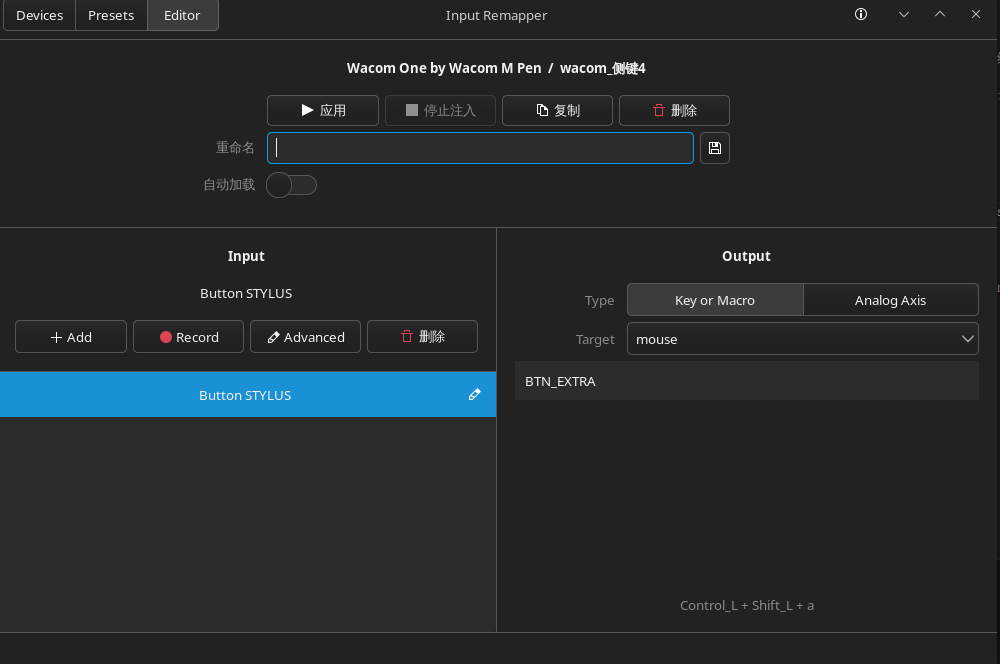

>原因是早些时间学blender时鼠标中键坏了，就绑定为侧键
>
>但是linux内wacom数位笔默认绑定只有**左键,右键,中键**

``` bash
## 按键绑定软件
paru -S input-remapper-git
sudo systemctl enable --now input-remapper
```
启动软件后找到名字带有wacom的设备，设置Presets

input录入数位笔,output选择要什么功能(下方会有按键提示)
:::tip
二次录入时记得停止注入
:::


:::tip
安装一些重要更新时，需要重启才能启动按键绑定
:::

**如果遇到wacom响应有问题**
```bash
## 如果不行就载入模块
sudo insmod /lib/modules/6.6.1-arch1-1/kernel/drivers/hid/wacom.ko.zst
```

参考:[input-remapper](https://github.com/sezanzeb/input-remapper?tab=readme-ov-file)